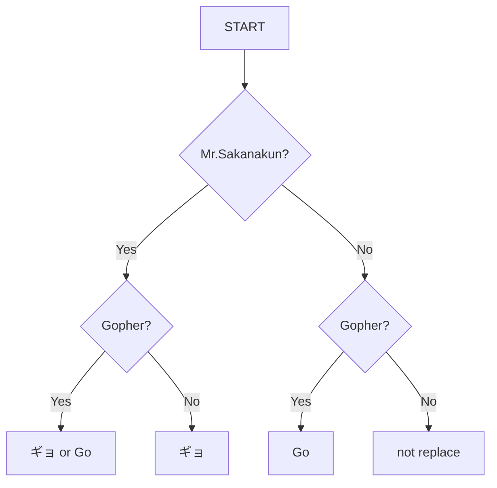

# sakanapher

[](https://github.com/kotaoue/sakanapher/actions/workflows/test.yml)
[](https://codecov.io/gh/kotaoue/sakanapher)
[](https://github.com/kotaoue/sakanapher/blob/main/LICENSE)

If Mr.Sakanakun is Gopher.

## Overview



## Usage

```ShellSession
$ go run main.go -message="おはようございます。ごきげんよろしゅうございますか？"
おはようございます。ごきげんよろしゅうございますか？

$ go run main.go -attribute=gopher -message="おはようございます。ごきげんよろしゅうございますか？"
おはようGoざいます。GoきげんよろしゅうGoざいますか？

$ go run main.go -name=sakanakun -message="おはようございます。ごきげんよろしゅうございますか？"
おはようギョざいます。ギョきげんよろしゅうギョざいますか？

$ go run main.go -name=sakanakun -attribute=gopher -message="おはようございます。ごきげんよろしゅうございますか？"
おはようぎょざいます。Goきげんよろしゅうぎょざいますか？
or
おはようGoざいます。ぎょきげんよろしゅうGoざいますか？
```
