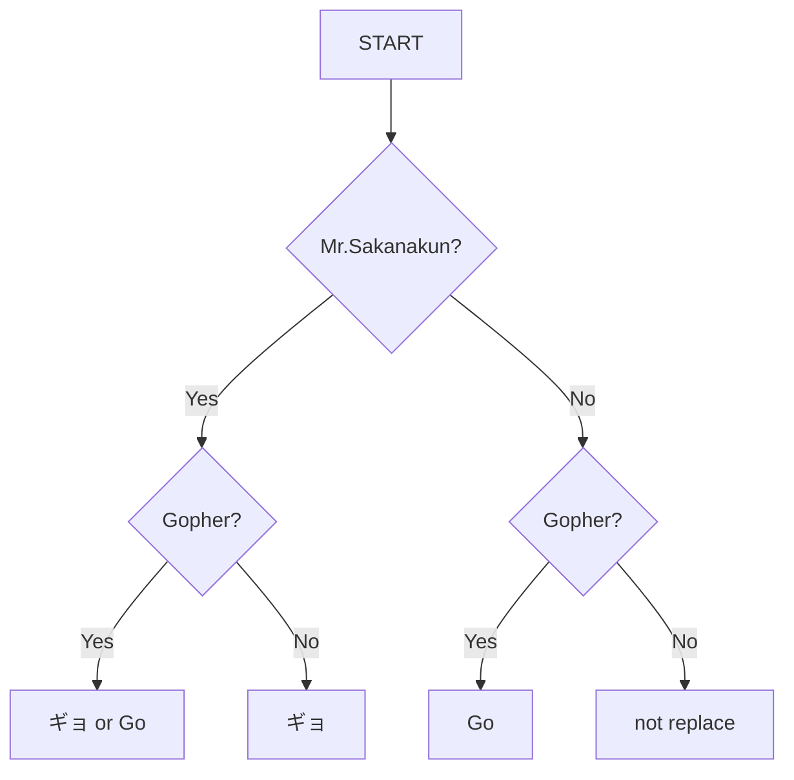

# sakanapher
If Mr.Sakanakun is Gopher.

## Overview

## Usage
```ShellSession
$ go run main.go -message="おはようございます。ごきげんよろしゅうございますか？"
おはようございます。ごきげんよろしゅうございますか？

$ go run main.go -attribute=gopher -message="おはようございます。ごきげんよろしゅうございますか？"
おはようGoざいます。GoきげんよろしゅうGoざいますか？

$ go run main.go -name=sakanakun -message="おはようございます。ごきげんよろしゅうございますか？"
おはようギョざいます。ギョきげんよろしゅうギョざいますか？

$ go run main.go -name=sakanakun -attribute=gopher -message="おはようございます。ごきげんよろしゅうございますか？"
おはようぎょざいます。Goきげんよろしゅうぎょざいますか？
or
おはようGoざいます。ぎょきげんよろしゅうGoざいますか？
```
